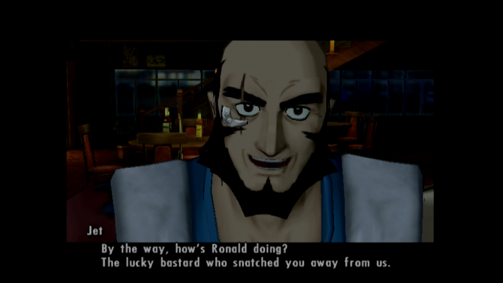
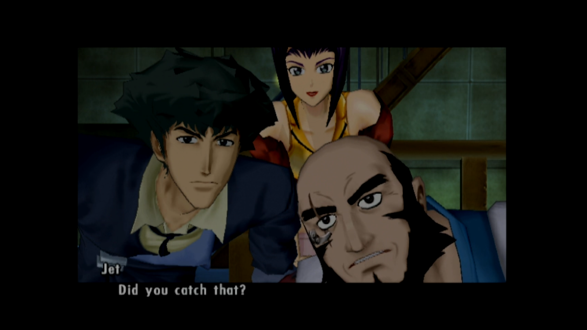
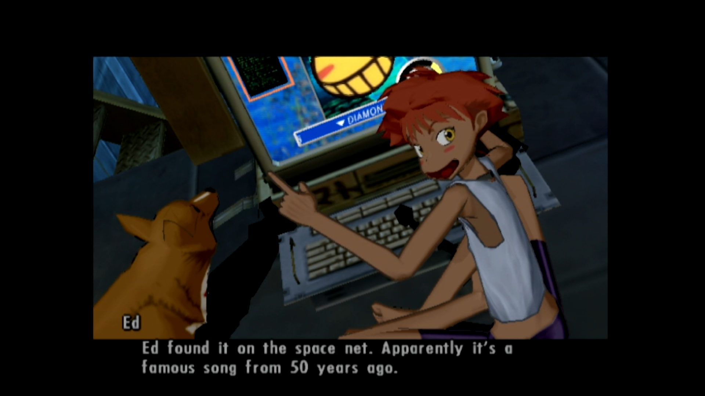

[](https://github.Bebop-PS2-English)
  <p align="center">
    English patch for the Cowboy Bebop PlayStation 2 game released in 2005.</i>
</p>

<p align="center">
    Original game title: <i>Cowboy Bebop 追憶の夜曲</i> (<i>Cowboy Bebop: Tsuioku no Serenade</i>)
</p>

## 💬 English Translation

A full 100% English fan translation patch with all text, graphics, credits and much more translated.

<p align="center">
    
    
    
</p>

The patched game works on the *PCSX2* emulator and real *PlayStation 2* hardware.

> [!CAUTION]
> Ein's Epic Adventure can only be unlocked by completing the game on normal difficulty.
> 
> After completing the game you will unlock a "2nd Opening". I have no idea what this is referring to.
> 
> For OPL users, enable compatibility modes 1 and 2, and make sure GSM is disabled. VMC and PADEMU are safe to use.

> [!WARNING]
> Setting "Translation" in the game options to "none" will break all text in the game.


## 💾 Download & Checksums

| File (sha1sum)                                                                          | Size    | Download                                                            |
|-----------------------------------------------------------------------------------------|---------|---------------------------------------------------------------------|
| Original ISO<br/>3e6968ec5b83d930b9536e96f8911c7f2256c19f                               | 3.17 GB | Dump your own disc!<br/>Either original or Shokai Genteiban Box.    |
| COWBOY_BEBOP_PS2_PATCHER_ENGLISH_1.0.0.zip<br/>a392778444168c9428fbc9ba35eb11ae8bcc8d70 | 667 MB  | [💾 See releases](https://github.com/Bebop-PS2-English/releases)    |
| COWBOY_BEBOP_PS2_ENGLISH_PATCHED_1.0.0.iso<br/>966e76a618608c9b84bfaf9756974fc91ef99d5d | 2.21 GB | Generate this file using our patcher.                                |

The patcher works on Windows and Linux.

### How to use the patcher easily

Drag and drop the original ISO file onto the `WINDOWS_DROP_BEBOP_PS2_ISO_HERE.bat` file if you are using Windows.

https://private-user-images.githubusercontent.com/138543979/480258597-41a56e75-dd78-4cb7-8ff1-833512893802.mp4

Drag and drop the original ISO file onto the `LINUX_DROP_BEBOP_PS2_ISO_HERE.sh` file if you are using Linux. Note: The file must be executable and your environnment must be allowing drag and drop a file onto a `.sh` script.

### How to use the patcher manually (using command line)

```bash
# In Windows CMD
.\WINDOWS_DROP_BEBOP_PS2_ISO_HERE.bat original_bebop_ps2.iso

# In a Linux shell
bash LINUX_DROP_BEBOP_PS2_ISO_HERE.sh original_bebop_ps2.iso
```
## 🏆 Credits
|                     | Credits                             |
|---------------------|-------------------------------------|
| Translation         | SONICMAN69                          |
| Programming         | anonymous                           |
| Graphics            | anonymous                           |
